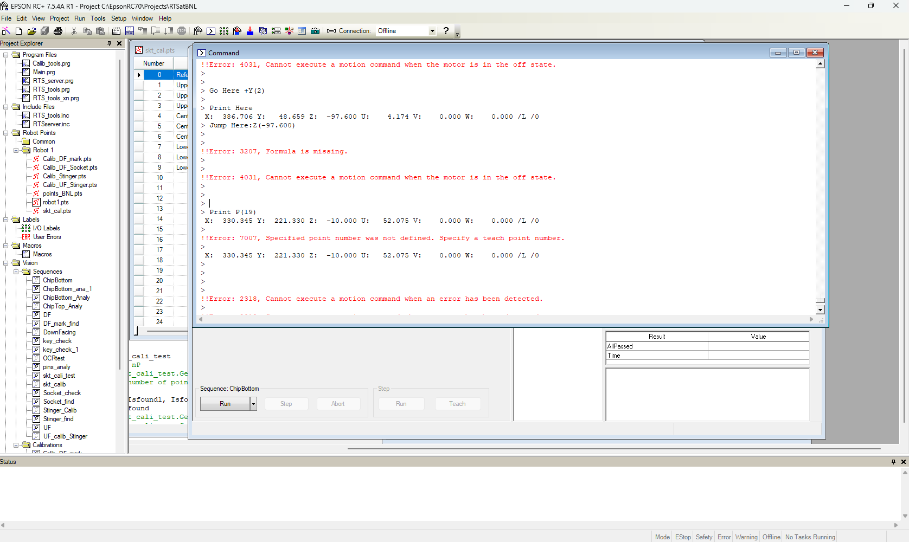

**WARNING:: 05/19/2025**, Current version have some problem with LarASIC and ColdADC, due to failure seperate some specific rotation for COLDATA and LarASIC and ColdADC. It is expected to be fixed in 2 weeks from now.

This is the test version we use at BNL. It might not be very general to everyone but we are trying to do it.

If you have any question about this version please contact:

Tishchenko, Vladimir <vtishchenko@bnl.gov>

Xuyang Ning <xning@bnl.gov> 

## Get start

Please download the whole file and open with EPSON RC+ 

Details of the hardware setup can be found in Wiki.

This is a brief introduction of the software.

1. Open the project in EPSON RC+.

2. Ethernet connection.

3. Compile the project.


After the compilation, you can start with easy command check:

Open the command window. 


Command window is a place you can easily control the robot by typing the command line by line and press `Enter`. It's a good place to get used to your robot and debug your code.

Type
```
Motor On
JumpToCamera
```
The robot arm should "Jump" to the middle where the upfacing camera is lying.

Some useful commands one can try for starter (keep updated):
```
'Turn on and off the pump. Pump is used to provide the vacuum to pick the chips.
PumpOn
PumpOff

'Turn on and off the Motor. Robot can only be moved with motor on
Motor On
Motor Off

'Turn on and off the camera light. 
UF_camera_light_ON
UF_camera_light_OFF

'Print the current coordinate of the robot
Print Here
```

## General discription of the program

- In general, please keep in mind that the robot's duty is only doing 2 actions:
`MoveChipFromTrayToSocket` and `MoveChipFromSocketToTray`
    - The defination of the number of Socket and Trays can be found in Wiki.
    - An simple example here, is Tray(2,1,1) move to Socket(2,1).

- The main part of the program is:
`Main.prg`
    - The most important part in the main is call this two functions for test.

    - The line ```Call RTS_server```will allow the Robot to receive commands from other program, so that we can control it with external project combine it with CE test.

- Most of the function is defined in `RTS_tools.prg`
Here is a diagram of how `MoveChipFromSocketToTray` works:


In this process, the green blocks require vison process.

Here is a diagram of how `ChipBottomAnaly` works:


`MoveChipFromTrayToSocket` is similar.
More details can be included later if needed.

## Vision process

Vison process is controled interactively through window. Here we provide a useful link here for vision calibration tutorial:
[Robot vision Guidance](https://www.youtube.com/watch?v=oHJ9Q0wdiCo)

- More advanced advise:
The calibration is sensitive to the Z axis of the robot. So if you want to use the returning **ROBOT XYZ**, a correct calibration is needed. In our current code, we use the returning position to do socket position correction.

## Points in RTS

Most points used in the robot is in `robot1.pts` with discription in that file. The defination can be found in Wiki. For the current version, only 2 tray position and 8 larASIC position in socket2 position is used.


The position calibration can be updated with the help of vision process.

Addtionally, the height when perform `PickupFromTray`, `DropToTray`, `PickupFromSocket`, `InsertIntoSocket`, `isChipInSocket` and `isChipInTray` might also need to be changed. Now they are hard coded in `RTS_tools.prg`.
